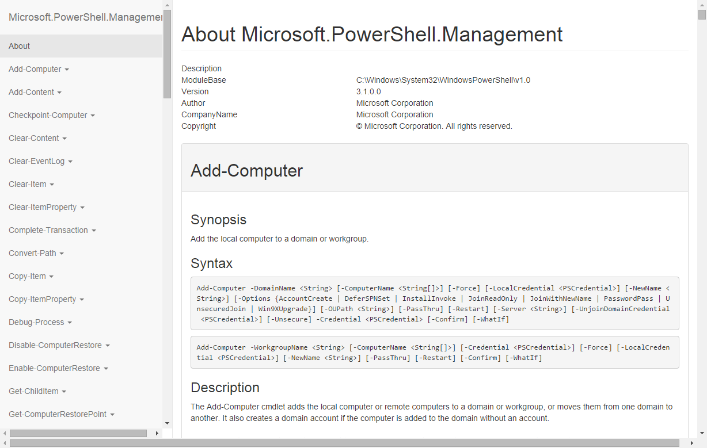

Invoke-CreateModuleHelpFile
===========================

PowerShell function to create a HTML help file for a module and all it's commands.



First load the function, then run it like this:

```powershell
Invoke-CreateModuleHelpFile -ModuleName 'ModuleName' -Path 'drive:\path\to\save.html'
```

To read the built-in help:

```powershell
Get-Help Invoke-CreateModuleHelpFile
```

TODO:
- Create fallback CSS for use without Bootstrap and jQuery